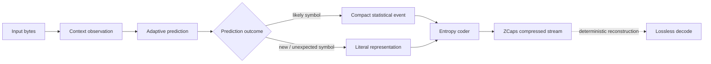

# ZCaps

### Adaptive lossless statistical compression research by Zetako Compression Lab

> **ZCaps is a general-purpose lossless compression architecture based on adaptive contextual prediction and statistical entropy coding.**
>
> The current validated ZCaps implementation is operational and integrated into **ZNode**, Zetako's sovereign workspace platform. Alongside that production-oriented line, Zetako Compression Lab is now using reconstructed historical ZCaps research as a reference for new work on compression density, model mixing and multicore execution.

[](#lossless-by-design)
[](#research-status)
[](#current-implementation-status)
[](#public-research-private-implementation)

---

## Current implementation status

ZCaps is not only a laboratory prototype.

The **current validated implementation works as a complete lossless codec and is integrated into ZNode**. The active product-oriented line therefore remains the modern ZCaps implementation: it is the reference for integration, deployment and practical throughput work.

The newly reconstructed historical generation described later in this repository is **not a replacement for the current ZCaps implementation**. It is a research reference that gives us a second point on the compression-density / compute-cost curve and exposes ideas worth re-evaluating with modern hardware and implementation techniques.

```text
                         ZCaps
                           │
              ┌────────────┴────────────┐
              │                         │
      Current validated line      Research line
              │                         │
        ZNode integration        historical reconstruction
        practical throughput    ablations / model research
        production evolution    Strong / Max experiments
              │                         │
              └────────────┬────────────┘
                           │
                  future validated work
```

---

## Why ZCaps exists

Most widely deployed general-purpose compressors belong to families built around **dictionary matching**, **sequence matching**, or transformations designed to expose repeated patterns.

These approaches are extremely successful. DEFLATE, LZMA and Zstandard are examples of highly engineered codecs built on decades of research around repeated strings, match finding, dictionaries and entropy coding.

ZCaps explores a different question:

> **What if the compressor focuses less on finding a previous copy of a sequence, and more on continuously learning what is statistically likely to come next?**

That is the research direction behind ZCaps.

ZCaps is not intended as a reimplementation of gzip, Zstandard, Brotli, LZMA or another existing codec. It is an independent lossless compression architecture developed by Zetako Compression Lab.

---

## Classical dictionary compression vs. ZCaps

A simplified dictionary-based compressor often behaves conceptually like this:

```text
input bytes
    │
    ▼
search previous data
    │
    ├── repeated sequence found ──► encode match / distance / length
    │
    └── no useful match ──────────► encode literal
    │
    ▼
entropy coding
    │
    ▼
compressed stream
```

ZCaps takes a different route:

```text
input bytes
    │
    ▼
observe context
    │
    ▼
adaptive prediction
    │
    ▼
statistical confidence / model update
    │
    ▼
entropy coding
    │
    ▼
compressed stream
```

The distinction matters.

| | Traditional LZ / dictionary family | ZCaps research direction |
|---|---|---|
| Primary question | "Where did this sequence appear before?" | "Given this context, what is likely to appear next?" |
| Main representation | matches, distances, lengths, literals | prediction outcomes and literals |
| Learning | usually dominated by match history / dictionary state | continuously adaptive statistical state |
| Data view | repeated sequences | evolving byte-level context |
| Core research focus | match finding, parsing, dictionary efficiency | prediction quality, adaptation, entropy efficiency |
| Lossless | yes | yes |

This is intentionally a high-level comparison. Modern compressors are complex systems and often combine several techniques. The table describes the **primary architectural difference ZCaps is investigating**, not every mechanism used by every existing codec.

---

## High-level ZCaps architecture

The production implementation is proprietary, but its public conceptual model can be described in three stages.

### 1. Context observation

ZCaps derives compact state from recently observed data and uses that state to identify previously learned behaviour associated with similar contexts.

The goal is not simply to locate an earlier identical string. The goal is to estimate which symbol is most plausible next.

### 2. Adaptive statistical prediction

Prediction confidence evolves while the stream is processed.

The model is **online and adaptive**: encoder and decoder update equivalent state deterministically as symbols are processed. No external model or pre-trained dictionary is required for the standard codec.

### 3. Entropy coding

Prediction decisions and literal information are converted into the final compressed representation using statistical entropy coding.

Because encoder and decoder evolve the same model from the same history, the original byte stream can be reconstructed exactly.



---

## Lossless by design

For ZCaps, "better compression" is never allowed to mean "approximately correct".

Every production candidate must preserve the source byte-for-byte.

Our benchmark workflow therefore treats compression ratio and throughput as secondary to the first requirement:

> **decode(encode(data)) == data**

Validation uses cryptographic hashes of the source and reconstructed output. Experimental variants that improve speed or size but fail exact round-trip validation are rejected from the production line.

---

## Research status

ZCaps is under active development.

The current validated implementation has been tested across well-known lossless-compression corpora including:

- Calgary Corpus
- Canterbury Corpus
- Canterbury Large
- Canterbury Artificial
- ENWIK
- Silesia Corpus

A recent validation pass covered **50/50 corpus files successfully**, with exact SHA-256 round trips.

### Current compression snapshot

The following figures are examples from the current research build. `Ratio` means compressed size divided by original size: lower is better.

| Corpus | Current ratio | Space reduction |
|---|---:|---:|
| Canterbury | 21.67% | 78.33% |
| Canterbury Large | 27.39% | 72.61% |
| Silesia | 29.40% | 70.60% |
| ENWIK | 30.44% | 69.56% |
| Calgary | 31.84% | 68.16% |

These values are research measurements, not universal promises. Compression behaviour varies substantially with input structure, entropy, file size, compiler, platform and measurement method.

### Current throughput snapshot

On an Apple Silicon M4 development system, a core-only benchmark of the current implementation measured approximately:

| Corpus | Encode | Decode |
|---|---:|---:|
| Silesia | **81.38 MiB/s** | **44.42 MiB/s** |
| ENWIK | **54.28 MiB/s** | **42.13 MiB/s** |

These are **raw compression-core measurements**, not end-to-end archive/application throughput. Integrity checks, container handling, storage and filesystem behaviour add additional cost in a complete product path.

---

## Historical reconstruction: a new research baseline

A historical ZCaps generation was recently reconstructed from archived design material and source fragments, then rebuilt as an executable lossless reference.

The purpose of this work is not to revive an old product implementation. It gives the lab a validated historical baseline built around a richer predictive path, including multiple adaptive statistical signals, model combination and history-derived prediction before entropy coding.

The reconstructed reference completed the same 50-file benchmark with **50/50 exact SHA-256 round trips**.

### Reconstructed legacy snapshot

| Measurement | Result |
|---|---:|
| Original data | 315.15 MiB |
| Compressed data | 90.32 MiB |
| Global ratio | **28.66%** |
| Space reduction | **71.34%** |
| Encode throughput | **2.12 MiB/s** |
| Decode throughput | **1.89 MiB/s** |
| Exact round trips | **50/50** |

Selected corpus results:

| Corpus | Ratio | Encode | Decode |
|---|---:|---:|---:|
| ENWIK | **31.53%** | **2.08 MiB/s** | **1.82 MiB/s** |
| Silesia | **27.58%** | **2.15 MiB/s** | **1.93 MiB/s** |

The result is useful precisely because the trade-off is so different from the current implementation: the historical architecture can reach strong compression density, but at dramatically higher compute cost.

This gives ZCaps research two complementary references:

- **current ZCaps** — practical throughput, validated operation and ZNode integration;
- **reconstructed historical ZCaps** — a compression-density reference for studying richer prediction and model combination.

The research question is now not simply which version is "better". It is:

> **Which predictive mechanisms create measurable compression gains, what do they cost, and how much of that gain can be recovered in a modern implementation?**

---

## What the historical reconstruction teaches us

The reconstructed generation confirms that the ZCaps research lineage explored several ideas that remain relevant today:

- multiple adaptive statistical predictors rather than a single fixed model;
- online confidence adjustment between predictive signals;
- history-derived prediction combined with contextual modeling;
- deterministic encoder/decoder state evolution;
- statistical entropy coding driven by the resulting probability estimate.

This is important because it turns historical work into something measurable. Individual mechanisms can now be removed, replaced or recombined and evaluated against the same benchmark suite.

The public repository intentionally describes these ideas at an architectural level. Internal state layouts, tuning data and implementation details remain proprietary.

---

## What we are researching now

ZCaps development is deliberately separated into different optimization goals rather than forcing every workload into one compromise.

### Balanced

The current validated reference profile.

Research focus:

- preserve validated compression behaviour;
- maintain practical integration in ZNode;
- reduce implementation overhead;
- improve compiler and architecture-specific code generation;
- reduce end-to-end container cost without changing compressed-data semantics.

### Fast

A throughput-oriented research profile.

The objective is to trade a small amount of compression density for lower latency, smaller working state and higher encode/decode throughput.

Early experiments indicate that this is a promising direction, particularly for applications where CPU time or decode latency matters more than the final few percent of size.

### Strong / Max

A compression-density research profile.

The reconstructed historical architecture provides a useful reference for this work. Current experiments investigate which additional predictive mechanisms can improve density while remaining deterministic and lossless.

Research areas include:

- ablation of historical predictive components;
- richer model combination;
- hybridization of current and historical predictors;
- improved history and match-derived signals;
- alternative model initialization strategies;
- multicore and block-parallel execution for compute-heavy profiles.

The objective is to build a **Pareto frontier between compression density and throughput**, rather than optimize only one number.

### Matrix-conditioned and keyed-model research

One experimental branch studies how different deterministic model initializations affect both compression behaviour and the resulting compressed representation.

This creates two separate research questions:

1. can alternative initial states improve compression density for particular or general-purpose workloads?
2. can a model initialization derived from secret material be useful as an additional key-conditioned transformation inside a compression pipeline?

The second question is **research only**. Zetako does not present model-conditioned compression as a replacement for established authenticated encryption. Any future security claim would require dedicated cryptanalysis and would remain separate from the standard ZCaps codec.

---

## Multicore research

The strongest statistical models can be computationally expensive because prediction state evolves continuously with the stream.

A direct bit-level parallelization would break that dependency, but independent block processing provides a practical research path:

```text
large input
   │
   ├── block A ──► core 1 ──► compressed block A
   ├── block B ──► core 2 ──► compressed block B
   ├── block C ──► core 3 ──► compressed block C
   └── block D ──► core 4 ──► compressed block D
```

The trade-off is measurable: smaller independent blocks increase parallelism and random access, while larger blocks preserve more model history and may improve compression density.

ZCaps research will therefore treat **block size, core count, throughput and compression ratio as a joint optimization problem** for Strong / Max profiles.

---

## Why adaptive prediction is interesting

Dictionary compressors are excellent when the data contains reusable sequences that can be represented efficiently as references.

A predictive statistical model attacks redundancy from another angle.

Consider structured data where many symbols are not necessarily part of one long repeated phrase but are highly predictable from local context:

```text
{"type":"event","status":"ok","time":...}
{"type":"event","status":"ok","time":...}
{"type":"event","status":"error","time":...}
```

A dictionary codec can exploit repeated strings.

A contextual predictor can additionally learn that after a particular evolving context, some symbols are much more probable than others. The entropy coder can then assign very little information to highly expected outcomes and more information to surprising ones.

This principle is not unique to ZCaps; statistical and context-modeling compression has a long research history. What is proprietary to Zetako is the specific ZCaps architecture, state representation, adaptation strategy, implementation and optimization work used to make that approach practical as a general-purpose codec.

---

## Benchmark philosophy

Compression benchmarks are easy to make misleading.

For public ZCaps research we follow a few rules:

1. **Lossless validation comes first.** Every reported candidate must reconstruct the original exactly.
2. **Known corpora are preferred.** Public benchmark sets make results easier to reproduce and compare.
3. **Ratio and speed are reported together.** A codec that is smaller but dramatically slower is a different engineering choice, not automatically "better".
4. **Current and historical lines are identified clearly.** Historical research results are not presented as current product performance.
5. **Core and product measurements are separated.** Raw codec throughput must not be confused with archive/container, hashing or filesystem overhead.
6. **Failed experiments are useful research.** A fast experimental branch that fails exact reconstruction is considered a failed codec candidate, not a successful benchmark.
7. **Hardware and methodology matter.** Results should always identify the platform, compiler and benchmark scope.

---

## What ZCaps is not

ZCaps is **not**:

- a lossy compressor;
- a wrapper around gzip, Zstandard, Brotli or LZMA;
- a file-type-specific compressor;
- a pre-trained machine-learning model;
- a public-source implementation at this stage.

It is a native general-purpose lossless compression research project centered on adaptive statistical prediction.

---

## Research evolution

The project has evolved through multiple internal generations. The reconstruction of an earlier generation now makes part of that evolution directly measurable.

```text
                   historical ZCaps research
                             │
                    reconstructed baseline
                             │
               ┌─────────────┴─────────────┐
               │                           │
        model discoveries          implementation lessons
               │                           │
               └─────────────┬─────────────┘
                             │
                      current ZCaps
                             │
                    validated in ZNode
                             │
               ┌─────────────┴─────────────┐
               │                           │
         Fast / Balanced              Strong / Max
```

The goal is not to publish a sequence of version numbers for their own sake. Each public milestone should represent a measurable improvement in one or more dimensions:

**compression density · throughput · robustness · deployability**

without sacrificing exact reconstruction.

---

## Public research, private implementation

This repository is intentionally a **public research and benchmark record**.

It may contain:

- architecture explanations at a non-proprietary level;
- benchmark methodology;
- benchmark results;
- historical reconstruction results;
- research notes;
- version/milestone history;
- reproducibility information;
- comparisons with established compression families.

It does **not** contain the production compression source code, proprietary state structures, internal tuning data or implementation details required to reproduce the ZCaps engine.

This allows Zetako Compression Lab to document the work transparently while preserving the intellectual property of the codec itself.

---

## Planned public sections

As the public research record grows, this repository will add dedicated material for:

- benchmark methodology and reproducibility;
- corpus-by-corpus results;
- evolution of validated ZCaps generations;
- historical vs. current research comparisons;
- Fast / Balanced / Strong / Max research profiles;
- multicore compression experiments;
- model-initialization research;
- comparisons with established general-purpose codecs;
- architecture and platform performance notes.

---

## About Zetako Compression Lab

ZCaps is developed by **Zetako Compression Lab**, part of Zetako's research into lossless compression architectures for general-purpose data, constrained systems and high-volume infrastructure.

Other Zetako compression research includes specialized work for blockchain data and embedded/constrained environments. ZCaps is the laboratory's general-purpose adaptive statistical compression line.

---

## Contact

**Zetako**  
Luxembourg  
contact@zetako.ai

Research project: **ZCaps — Adaptive Lossless Statistical Compressor**

---

<sub>Benchmark figures in this repository represent specific research runs and may change as the implementation, compiler toolchain and methodology evolve. Historical reconstruction figures are research references and must not be interpreted as current ZNode product throughput. All performance claims should be read together with their benchmark environment and validation scope.</sub>
